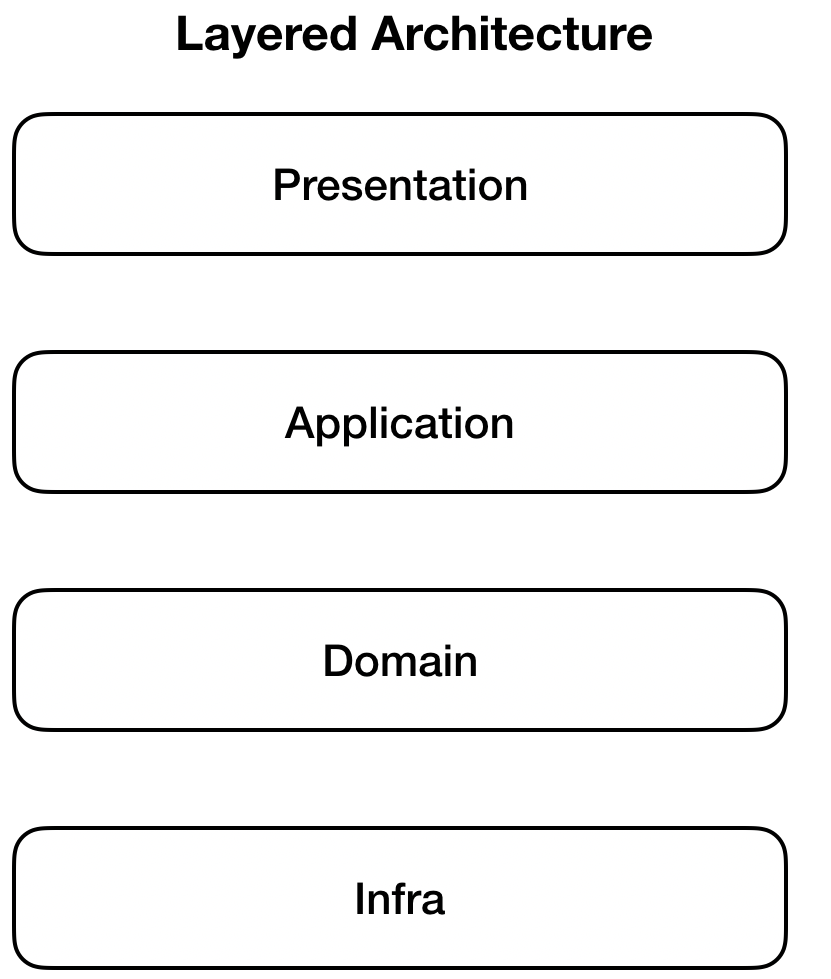

# DDD

### 들어가며

DDD 는  도메인 주도 방식(Domain Driven Design)의 설계를 의미한다. 기존에도 단순한 도메인을 중요시 여기는 문화는 많이 자리잡고 있었다. 하지만, 소스 코드 단까지 도메인을 중요시 여기고, 이를 설계까지 담아내는 것을 도메인 주로 설계 방식이라고 한다.

### 아키텍쳐

크게 4계층의 레이어로 아키텍쳐를 구분합니다.

- 프레젠테이션(Presentation): 외부의 입/출력 처리
- 애플리케이션(Application): 사용자 시나리오 구현
- 도메인(Domain): 비지니스 구현
- 인프라(Infrastructure): 기술적 세부 구현

표현계층(Presentation)은 응용계층(Application)을 직접적으로 참조할 수 없다. 이러한 규칙을 통하여 의존성을 그래프가 아닌 트리로 만들 수 있다.

### 도메인

도메인은 오로지 순수한 비지니스 규칙을 담고 있는 핵심 영역이다. 가장 중요한 부분은 도메인에 집중해서 행위를 구현하는 것이다. 도메인은 기술적 세부적 구현 사항에 대해서는 다루지 않습니다.

### 인프라스트럭처

기술적 세부사항들을 구현합니다. 예를 들어 데이터베이스, 써드파티 API, 외부 서비스와의 통신, 메세지 브로커 등의 사항들을 구현합니다. 기술적인 세부사항들과 비즈니스 규칙을 구분지어 비지니스 규칙을 조금 더 독립적으로 구현할 수 있습니다.

### 애플리케이션

시나리오를 구현하는 계층입니다. 도메인 모델에 정의된 메서드를 플로우에 따라 호출하고, 외부 서비스들과 상호작용하는 계층입니다.

### 인터페이스

사용자와 상호작용하는 계층입니다. 입/출력을 담당합니다. 인터페이스의 관심사는 아래와 같습니다.

- 입/출력 프로토콜 제공
- 입력 유효성 검사
- 애플리케이션 호출

### 정리

현재는 다양한 회사에서 DDD를 적용하여 서비스를 만들고 있습니다.

도메인을 중심으로 설계하면 각 도메인의 책임과 행동이 명확해집니다. 도메인과 일치되게 소스를 구현하기 때문에 도메인 전문가와 협업에서 커뮤니케이션도 유리합니다. 도메인 행동에 모든 관심을 갖고 있기 때문에 관심사를 집중할 수 있고 설계를 간편화 할 수 있습니다.

DDD 개발방식이 발전되어 다양한 분야에서 활용되는 모습을 기대합니다.