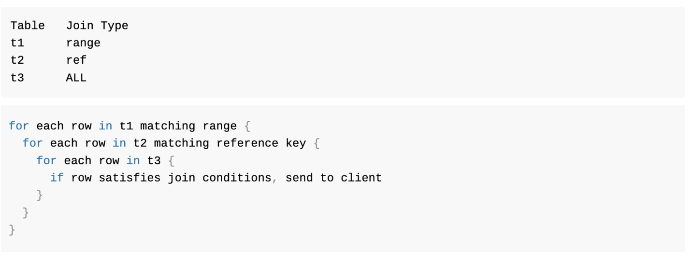

## 들어가며
장부와 관련된 많은 서비스에서 postgreSQL 를 활용하여 서비스를 구축합니다. 그 이유는 무엇인지 궁금하여 찾아보게 되었습니다.

## postgres 사용이유
Mysql 은 단순 CRUD, OLAP(Online Analytical Processing) 에 적합하고, Postgres 는 Mysql 에 비해 다양한 기능들을 제공하며 대규모 분석 프로세스에 접합하다고 한다.

### insert 에 적합
postgreSQL 은 **update 에 취약한 데이터 베이스**입니다.
- update , delete 존재하지 않습니다.
- 모든 실행은 insert

MVCC(다중 버전 동시성 제어) 와 VACUUM 를 통하여 update, delete 가 처리됩니다.

MVCC 란?
- DBMS에서 동시성을 위해 제공하는 MVCC(Multi-Version Concurrency Control) 기능은 여러 트랜잭션이 수행되는 환경에서 각 트랜잭션에게 쿼리 수행 시점의 데이터를 제공하여 읽기 일관성을 보장하고 Read/Write 간의 충돌 및 lock 을 방지하여 동시성을 높일 수 있는 기능이다. MVCC의 기본 원리는 트랜잭션이 시작된 시점의 Transaction ID 와 같거나 작은 Transaction ID 를 가지는 데이터를 읽는 것이다.

### hash join 을 활용한 query 속도 향상
postgreSQL 은 hash join 을 통한 빠른 검색을 할 수 있다. 이 기능은 mysql 8.0.18 버전부터 추가되었다. 

join 방식에 대해서 소개하면 아래와 같은 join 수행방식이 존재합니다.
- nested loop join
- sort/merge join
- hash join

**nested loop join** 방식은 아래와 같이 한 join 컨디션에 대한 검색을 진행한다.
아래와 같이 검색을 진행하기 때문에, full scan 이 일어나지 않으려면 index 가 필수이다.

**sort/merge join** 방식은 아래와 같이 데이터 혹은 인덱스를 스캔한 후 sort 를 진행하고, merge 합니다.

**hash join** 은 작은 테이블을 해쉬함수를 통하여 메모리에 올리고, 해당 해쉬값과 같은 지 검사하는 방식으로 작동합니다.

**결제 및 장부서비스**의 경우 인덱스가 컬럼인 돈과 관련된 정보들이 조인 되는 경우가 종종 발생할 수 있기 때문에 hash_join 을 사용할 수 있는 postgres 를 선택하는 경향이 있습니다.

## 결론
장부서비스의 경우 insert 가 빈번하고, hash join 을 활용하기 위해서 postgreSQL 을 사용하는 것으로 결론지었습니다.

출처 : https://coding-factory.tistory.com/757
